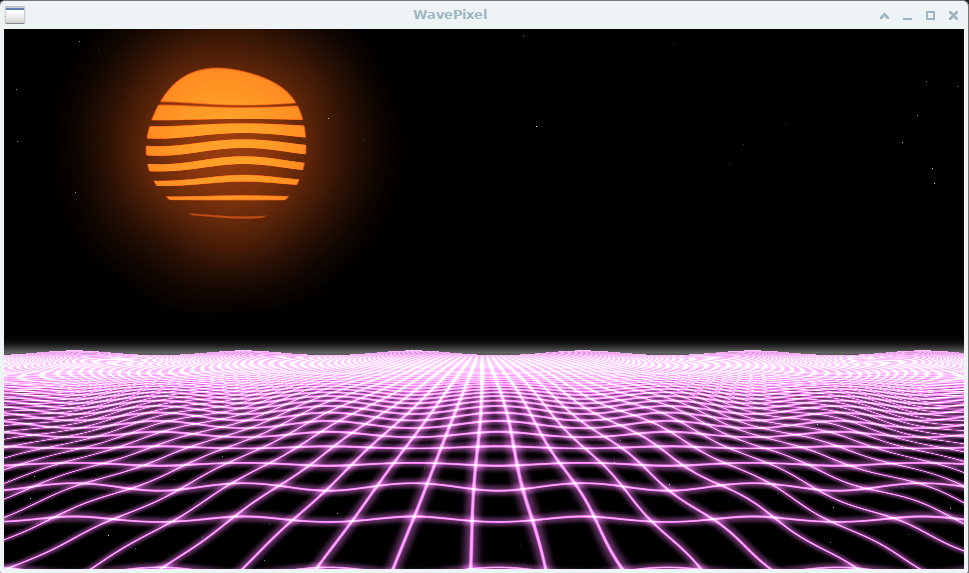

# WavePixel 

A hybrid application merging real-time OpenGL graphics with MIDI audio playback. Displays dynamic Shadertoy-inspired visuals (color-blended landscapes, sun, clouds, parallax) synchronized with MIDI music, enhanced by customizable audio effects.



## Features

- **Graphics**:  
  - Smooth color transitions with customizable palettes.  
  - Interactive elements: grid floor, sun with bloom, parallax effects, toggleable clouds.  
  - Fullscreen support and resolution scaling.  

- **Audio**:  
  - MIDI playback with effects: reverb, chorus, vibrato, tremolo, echo, stereo.  
  - SoundFont (`.sf2`) support for richer sound.  

- **Behavior**:  
  - Automatic MIDI looping.  
  - Real-time visual and audio adjustments.  

## Requirements

- **Files**:  
  - Place `.mid` (MIDI) files in the program directory.  
  - Optional: Add `.sf2` (SoundFont) files for enhanced audio.  

- **OS & Dependencies**:  
  - **Windows/Linux** with:  
    - SDL2  
    - SDL2_mixer  
    - GLEW  
    - OpenGL  

## Installation

### Linux (Debian/Ubuntu)
```bash
sudo apt install libsdl2-dev libsdl2-mixer-dev libglew-dev mesa-utils
```

### Windows (via MSYS2/Pacman)
```bash
pacman -S mingw-w64-x86_64-SDL2 mingw-w64-x86_64-SDL2_mixer mingw-w64-x86_64-glew
```

## Building

1. Clone the repository:
```bash
git clone https://github.com/Svarkovsky/WavePixel
cd WavePixel
```

2. Compile the program:
```bash
gcc -std=c17 -o wavepixel wavepixel.c \
-lSDL2 -lSDL2_mixer -lGLEW -lGL -lGLU -lm -Ofast
```

## Usage

1. **Add MIDI/SoundFont files**:  
   Copy your `.mid` and `.sf2` files into the program directory.  

2. **Run the application**:  
```bash
./wavepixel
```

### Controls

| Key           | Action                          |
|---------------|---------------------------------|
| `F`           | Toggle fullscreen               |
| `P`           | Next color palette              |
| `Ctrl + P`    | Toggle parallax effect          |
| `O`           | Toggle clouds                   |
| `S`           | Toggle sun                      |
| `X`           | Toggle color blending           |
| `C`           | Reset to black palette          |
| `Esc` / `Q`   | Quit                            |
| **→**         | Next MIDI track                 |
| **←**         | Previous MIDI track             |
| **← + → (2s)**| Pause/Resume playback           |

## Notes

- Without a `.sf2` file, audio will be disabled (visuals remain active).  
- The program scans the directory for new `.mid` files every 5 seconds.  

## License

[MIT License](LICENSE)
